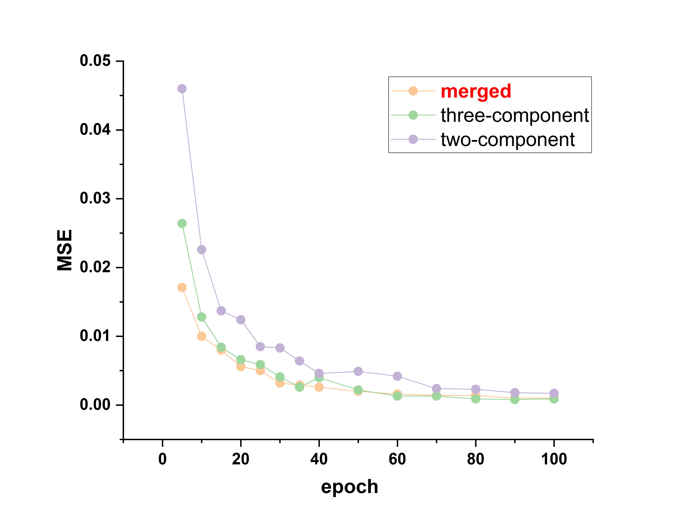

# MesoNet
####  A MesoNet Model for Predicting Physicochemical Property of Complex Systems.
This work presents a highly interpretable machine learning model designed to elucidate complex intramolecular and intermolecular interactions, particularly in multicomponent mixtures. The model achieves unified predictive modeling for both binary and ternary mixture systems within a single framework, overcoming key challenges in handling compositional diversity and interaction nonlinearity.  

Key features include:  
1) **Physics-aware architecture** that preserves chemical interpretability while capturing interaction hierarchies  
2) **Unified representation learning** enabling seamless cross-component generalization  
3) **cross scale mechanisms** that quantify contribution weights of molecular subgroups  

The model demonstrates superior performance in predicting mixture properties while maintaining transparency - offering both accurate predictions and mechanistic insights into interaction. 

**We believe that with the accumulation of data, this model may play a greater advantage in unified modeling composed of more properties and more components (>3).**

For more design concepts and details of the model, please refer to Article  **Non-Random Parameterized Networks for Cross-Scale Modeling of Compositional Interplay**

# Supporting Information
**Note: This section includes additional details not discussed in the main text**

## Unified Modeling Results Across Different Components
**RMSE for activity coefficient prediction.**
|model|two-component |three-component|merged |
|----------------|--------------------------------|--------------------------------|--------------------------------|
|SolvGNN | 0.077 |0.072 |unpredictable |
|NGNN | 0.064 |0.084 |unpredictable |
|**MesoNet** | **0.054** |**0.048** |**0.045** |

**Note**: ''Merged'' means merging two-component and three-component data into one dataset for prediction.

**Extrapolation results for unseen concentrations**
|0.5：0.5|MAE |RMSE|0.33：0.33：0.33|MAE |RMSE|
|----------------|--------------------------------|--------------------------------|----------------|--------------------------------|--------------------------------|
|two-component | 0.041 |0.071 |three-component | 0.052 |0.114 |
|**merged** | **0.019** |**0.035** |**merged** | **0.032** |**0.062** |

**Note**: The table shows the extrapolation performance of unseen concentration ratios when modeling separately with two-component and three-component datasets and when modeling with merged datasets.

The model not only improves prediction accuracy but also accelerates the training process when combining different components, as compared to training them individually. This capability enhances both efficiency and accuracy, making it well-suited for real-world applications where complex mixtures are common. By leveraging a unified modeling framework, the model successfully predicts molecular interactions across different mixture compositions with high precision.

All of the above evidence demonstrates the model's accurate representation of molecular interactions, enabling it to better identify the contributions of different molecules to the mixed system.

## Code running conditions

#MesoNet is implemented using Pytorch and runs on Ubuntu with NVIDIA GeForce RTX 4090 graphics processing units,which relies on Pytorch Geometric.

The following are the required Python libraries to be installed：numpy、pandas、rdkit、sklearn、ncps

## Data preparation
To facilitate the reproduction of our results, you only need to directly execute the code for each predicted property (this requires adjusting the CSV file path for the corresponding dataset to your local path). The code will generate the graph dataset (A file package containing a pt file) and then proceed to the next step of prediction. The code will output and print the errors for the training and test sets.

If you wish to use your own dataset for prediction, simply prepare the required molecular SMILES format and its properties for prediction, and then process the data into the same format as the one we provided.

## The following table shows an example of processing the activity coefficients of three components
|solv1_x|solv2_x|solv3_x|solv1_gamma|solv2_gamma|solv3_gamma|solv1_smiles|solv2_smiles|solv3_smiles|
|----------------|----------|----------|----------|----------|----------|----------|----------|----------|

## The following table shows the code and data files for different predicted properties
|properties |code name|dataset name |note |dataset size |
|----------------|--------------------------------|--------------------------------|--------------------------------|--------------------------------|
|**Solubility** | Solubility.py |Solubility.csv |A random run |8438 |
|**CMC** | cmc.py |cmc.csv |Specific dataset partitioning |1395 |
|**Lipophilicity** | lipophilicity.py |lipophilicity.csv |Three independent runs |4200 |
|**Ionization Energy (IE)** | IE.py |IE.csv |Three independent runs|2147 |
|**absorption wavelength** | ABS.py |aboso.csv |Three independent runs |3943 |
|**emission wavelength** | EM.py |EM.csv |Three independent runs |4038 |
|**PLQY** | PLQY.py |PLQY.csv |Three independent runs |2831 |
|**Two-component  Activity Coefficients** |Activity coefficient (two-component).py |Activity coefficient (two-component)_with_inf.csv |Five-fold cross validation |280000 (with inf),200000(without inf) |
|**Three-component Activity Coefficients** |Activity coefficient (three-component).py |Activity coefficient (three-component).csv |Five-fold cross validation |160000 |
|**Activity Coefficients (Merge 2 and 3 components)** |Activity coefficient (merged).py |Activity coefficient (Merged).csv |Five-fold cross validation |360000 |

## Running time

The generation of molecular graphs for single component and two-component datasets takes approximately a few minutes, while the activity coefficient, due to the large amount of data (greater than 100000), takes less than an hour to generate molecular graphs,all of which are created on a 10 core CPU.
For the running time of the model, it takes about several tens of hours to complete the complete five fold cross validation in the prediction of activity coefficients.
The prediction of other properties varies in time from tens of minutes to several hours.

## Hyperparameters and model prediction:
In our training, we did not perform hyperparameter tuning on the validation set for each individual attribute prediction and then make predictions on the test set. In single component, two-component, and three component prediction, we select the same hyperparameters (learning rate, number of neurons, network architecture, etc.) and directly use the training set for training and predicting the test set (validation set).

In model prediction, error printing is performed directly on the training and testing sets to observe the changes in training and prediction errors. Alternatively, the overall training error and best results can be saved.

ps： In practical applications, tuning hyperparameters for each property may increase the predictive performance of the model, but we did not do so because the training time was too long and the predictive performance was already better than the models reported in the literature.

## Continuously updated
We will continue to update data and models in the future，and we will constantly check the correctness and completeness of the code and data. If there are any code running errors or any questions, please contact my email: fanjinming@zju.edu.cn

