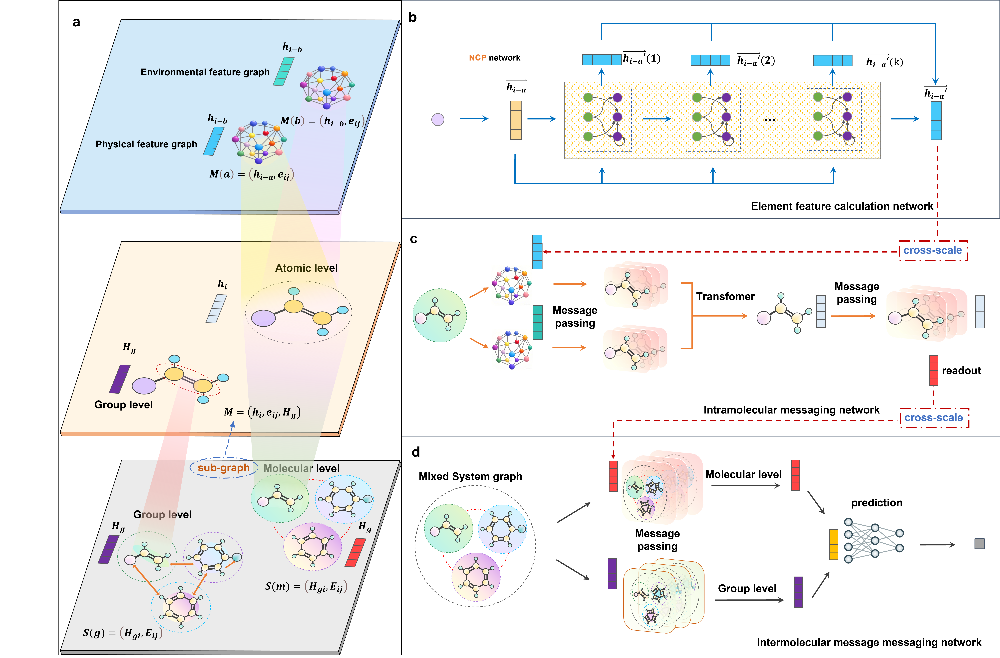
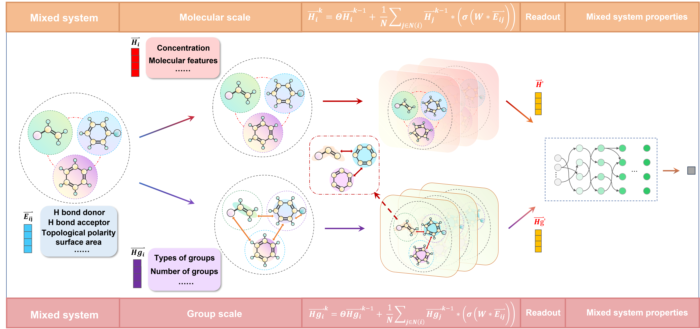

# MesoNet
####  A MesoNet Model for Predicting Physicochemical Property of Complex Systems.
For more design concepts and details of the model, please refer to Article  ***Non-Random Parameterized Networks for Cross-Scale Modeling of Compositional Interplay ***

# Overview

Here are the details about the model.

## Code running conditions

#MesoNet is implemented using Pytorch and runs on Ubuntu with NVIDIA GeForce RTX 4090 graphics processing units,which relies on Pytorch Geometric.

The following are the required Python libraries to be installed：numpy、pandas、rdkit、sklearn、ncps

## Data preparation
To facilitate the reproduction of our results, you only need to directly execute the code for each predicted property (this requires adjusting the CSV file path for the corresponding dataset to your local path). The code will generate the graph dataset (A file package containing a pt file) and then proceed to the next step of prediction. The code will output and print the errors for the training and test sets.

If you wish to use your own dataset for prediction, simply prepare the required molecular SMILES format and its properties for prediction, and then process the data into the same format as the one we provided.
## The following table shows the code and data files for different predicted properties

|properties |code name|dataset name |note |
|----------------|--------------------------------|--------------------------------|--------------------------------|
|**Solubility** | Solubility.py |Solubility.csv |A random run |
|**CMC** | cmc.py |cmc.csv |Specific dataset partitioning |
|**Lipophilicity** | lipophilicity.py |lipophilicity.csv |Three independent runs |
|**Ionization Energy (IE)** | IE.py |IE.csv |Three independent runs|
|**absorption wavelength** | ABS.py |aboso.csv |Three independent runs |
|**emission wavelength** | EM.py |EM.csv |Three independent runs |
|**PLQY** | PLQY.py |PLQY.csv |Three independent runs |
|**Two-component  Activity Coefficients** |Activity coefficient (two-component).py |Activity coefficient (two-component)_with_inf.csv |Five-fold cross validation |
|**Three-component Activity Coefficients** |Activity coefficient (three-component).py |Activity coefficient (three-component).csv |Five-fold cross validation |

## The following table shows an example of processing the activity coefficients of three components
|solv1_x|solv2_x|solv3_x|solv1_gamma|solv2_gamma|solv3_gamma|solv1_smiles|solv2_smiles|solv3_smiles|

## The following table shows the code and data files for different predicted properties

|properties |code name|dataset name |note |dataset size |
|----------------|--------------------------------|--------------------------------|--------------------------------|--------------------------------|
|**Solubility** | Solubility.py |Solubility.csv |A random run |8438 |
|**CMC** | cmc.py |cmc.csv |Specific dataset partitioning |1984 |
|**Lipophilicity** | lipophilicity.py |lipophilicity.csv |Three independent runs |4200 |
|**Ionization Energy (IE)** | IE.py |IE.csv |Three independent runs|2147 |
|**absorption wavelength** | ABS.py |aboso.csv |Three independent runs |3943 |
|**emission wavelength** | EM.py |EM.csv |Three independent runs |4038 |
|**PLQY** | PLQY.py |PLQY.csv |Three independent runs |2831 |
|**Two-component  Activity Coefficients** |Activity coefficient (two-component).py |Activity coefficient (two-component)_with_inf.csv |Five-fold cross validation |280000 (with inf),200000(without inf) |
|**Three-component Activity Coefficients** |Activity coefficient (three-component).py |Activity coefficient (three-component).csv |Five-fold cross validation |160000 |

## Running time

The generation of molecular graphs for single component and two-component datasets takes approximately a few minutes, while the activity coefficient, due to the large amount of data (greater than 100000), takes less than an hour to generate molecular graphs,all of which are created on a 10 core CPU.
For the running time of the model, it takes about several tens of hours to complete the complete five fold cross validation in the prediction of activity coefficients.
The prediction of other properties varies in time from tens of minutes to several hours.

<<<<<<< HEAD
## Hyperparameters
=======
## Hyperparameters:
>>>>>>> 7151ceab6d1d94cf75d7c2717109531965d31242
In our training, we did not perform hyperparameter tuning for the prediction of each individual property. This is because the hyperparameters of the existing model already outperform those of the best models reported in the literature. However, in specific applications, fine-tuning the hyperparameters for each predicted property may lead to improved prediction accuracy.

## Continuously updated
We will continue to update data and models in the future. If you have any questions, please contact my email: fanjinming@zju.edu.cn

